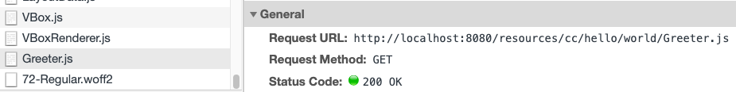
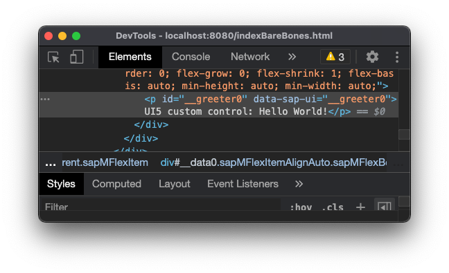
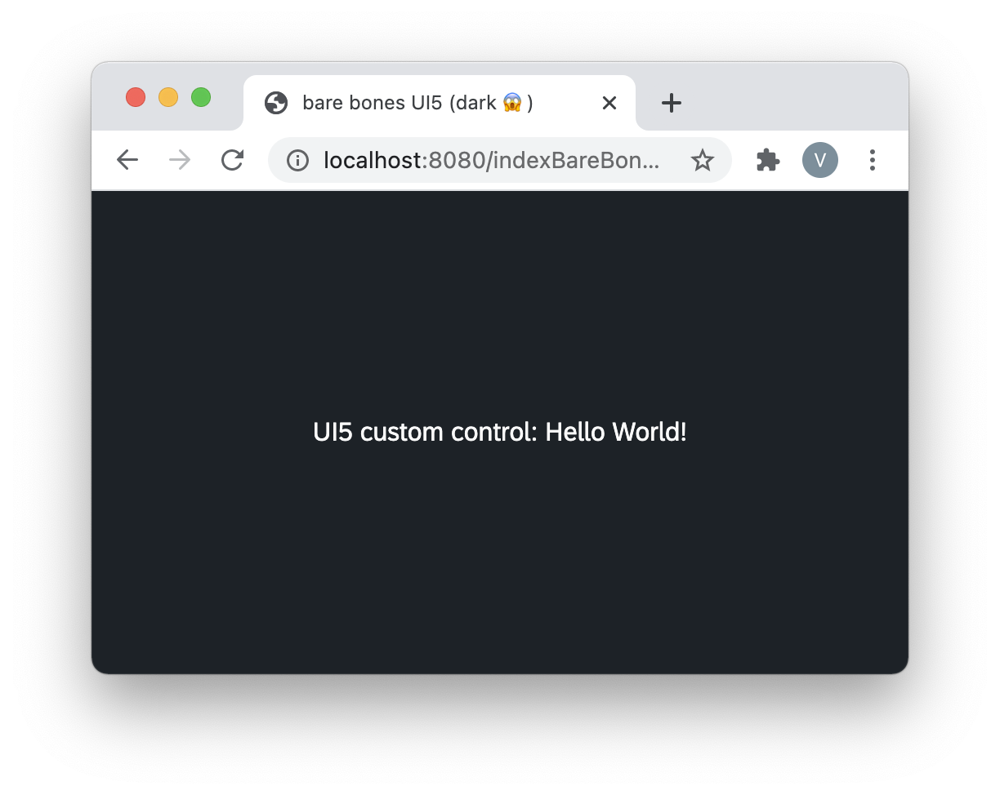

# Reuse UI5 custom controls via npm

*tl;dr*: the `ui5-tooling` supports using custom controls from the npm realm, for both development- and build-time. This makes re-use and distribution of custom controls easier than wrapping them in a library.

## in here:

* [prelude](#prelude)
* [dev-time: controls as npm modules](#dev-time-controls-as-npm-modules)
    * [npm-based UI5 custom control in an app](#npm-based-ui5-custom-control-in-an-app)
    * [3rd party modules in custom control](#3rd-party-modules-in-custom-control)
* [addendum: build time for the app](#addendum-build-time-for-the-app)
* [naming convention: ui5-cc-$name.space](#naming-convention-ui5-cc-namespace)


🔥 A barebones example repo is at <https://github.com/vobu/ui5-npm-custom-control>


## prelude

Until now, the primary means of reusing UI5 custom controls was to wrap them in a UI5 library and include that library in another UI5 app.

But next to `application` and `(theme-)library`, the `ui5-tooling` [also allows for a type `module`](https://sap.github.io/ui5-tooling/pages/Configuration/). This describes a generic …well.. "module" that can be attached to a namespace ("resource root", in UI5 speak).

```yaml
# packages/ui5-cc-hello.world/ui5.yaml
specVersion: "2.2"
type: module
metadata:
  name: ui5-cc-hello.world

resources:
  configuration:
    paths:
      "/resources/cc/hello/world/": "./" # note the trailing slashes!
```

Above noted `path` configuration tells the UI5 runtime to look for runtime artefacts of the namespace `cc.hello.world` in the current folder. (The `resources` part in the path is a requirement by the `ui5-tooling`.)

Subsequently, that namespace can be used by the UI5 runtime to include Controls, here: namespace `cc.hello.world`, Control `Greeter`(.js).



## dev-time: controls as npm modules

A UI5 custom control consists of the module logic and a renderer. They can either be split (e.g. look at `sap.m.Text.js` and `sap.m.TextRenderer.js`) or exist in the same file, using a static `renderer` function:

```javascript
// packages/ui5-cc-hello.world/Greeter.js
sap.ui.define(["sap/ui/core/Control"], (Control) => {
    return Control.extend("cc.hello.world.Greeter", {
        renderer: {
            apiVersion: 2,
            render(oRM, oControl) {
                oRM.openStart("p", oControl)
                oRM.openEnd()
                oRM.text("UI5 custom control: Hello World!")
                oRM.close("p")
            }
        }
    })
})
```



A UI5 type `module` can be transferred into an npm module by simply giving it an `npm init`:

```text
// file system view
ui5-cc-hello.world
├── Greeter.js
├── package.json
└── ui5.yaml

// package.json
{
  "name": "ui5-cc-hello.world",
  "version": "0.0.1",
  "description": "UI5 custom (notepad) control demo",
  "license": "Beerware"
}
```

By combining the `ui5-tooling` descriptor `ui5.yaml` with a `package.json`, the UI5 custom control now is the regular npm module `ui5-cc-hello.world` 🥳 - and can be released and required as such!

> hint: already note the naming convention
>
> ​	ui5-cc-\$name.space
>
> for UI5 controls in npm-verse.

### npm-based UI5 custom control in an app

In a UI5 app, it’s now as easy as requiring the custom control via `dependencies` and `ui5.dependencies`...

```json
// in packages/ui5-app/package.json
"dependencies": {
        "ui5-cc-hello.world": "0.0.1"
    },
"ui5": {
    "dependencies": [
        "ui5-cc-hello.world"
    ]
}
```

…and using the namespace and control in a view:

```xml
<!-- packages/ui5-app/webapp/indexBareBones.html -->
<!-- in xml template literal -->
<mvc:View xmlns:hello.world="cc.hello.world">
    <hello.world:Greeter />            
</mvc:View>
```



There's also no need to fiddle with `data-sap-ui-resourceroots` in the bootstrap html - the `ui5-tooling` automatically serves `resources/**/*` to the application.

A note on theming 🛠: while UI5 libraries generally contain support for themes, the here presented npm-custom control approach can only include theme-specific optics by [using CSS variables. Bespoken CSS variables](https://github.com/SAP/theming-base-content/blob/master/content/Base/baseLib/sap_fiori_3/css_variables.css) are recognized by the `ui5-tooling` at development time! Please dig into [the blog post by UI5 chieftain Peter Müßig](https://blogs.sap.com/2020/04/20/ui5ers-buzz-52-the-rendering-evolution-semantic-rendering-and-css-variables/) for how to use CSS variables in your UI5 app - and thus, in UI5 custom controls.

### 3rd party modules in custom control

Custom controls might need 3rd party npm modules at runtime, most likely to re-use functionality already out there, and not having to reinvent the wheel(s).

Fortunately, `shims` from the `ui5-tooling` can be used for achieving just that: using npm modules with UI5 ([see this nice blog post by Vivek C.](https://blogs.sap.com/2020/07/30/project-shims-using-npm-modules-with-ui5/)). And the same concept can be applied to npm-based custom controls as well.

First, the 3rd party modules needs to be included into the custom control by standard npm mechanism `npm install $dependency`, resulting in a `dependencies` entry into `package.json`.

```json
// from: ui5-cc-md
"dependencies": {
    "marked": "^1.2.9"
}
```

Then, use `ui5.yaml`'s `project-shim` to patch the module through to the custom control at runtime:

```yaml
# also from ui5-cc-md
specVersion: "2.2"
type: module
metadata:
  name: ui5-cc-md

resources:
  configuration:
    paths:
      "/resources/cc/md/": "./"
---
specVersion: "2.2"
kind: extension
type: project-shim
metadata:
  name: marked
shims:
  configurations:
    "marked":
      specVersion: "2.2"
      type: module
      metadata:
        name: "marked"
      resources:
        configuration:
          paths:
            "/resources/cc/md/marked/": "./"
```

The above `extension` provides the 3rd party module `marked` from the custom control’s `npm_modules` folder in the *same namespace as the custom control itself* (`cc.md`), at the path `/resources/cc/md/marked/`. 

The acutal `marked` module code can subsequently be loaded in the custom control via the standard `sap.ui.define`:

```js
sap.ui.define(["./marked/marked.min"], (/* marked */) => { /*...*/ })
```

No more need to copy/paste 3rd party source code into the custom control realm!

## addendum: build time for the app

When developing custom controls, there’s generally no need for build artefacts. Once the code runs as desired, the ui5 custom control can be published to npm or any other registry, and is ready to use. Optimizations -such as providing a minified, runtime-optimized version and a `-dbg.js` human readable counterpart, are possible, but not required.

From the viewpoint of the *application* the npm-distributed custom control is used in, a "standalone" build is necessary to make the app -including the custom control(s)- run in enviornments other than the `ui5-tooling`. By doing `ui5 build --all` , the npm-based custom controls are copied into the `dist/resources` folder (including all shims!) and are available for deployment.

```bash
$> ui5 build --all
info normalizer:translators:ui5Framework Using OpenUI5 version: 1.86.3
info builder:builder Building project ui5-app including dependencies...
info builder:builder 🛠  (1/9) Building project ui5-cc-hello.world
info builder:builder 🛠  (2/9) Building project marked
info builder:builder 🛠  (3/9) Building project ui5-cc-md
# ...
```

This results in a `dist` folder containing all custom controls and shims:

```bash
# sample app incl ui5-cc-md + ui5-cc-hello.world
ui5-app/dist/resources
├── cc
│   ├── hello
│   │   └── world
│   │       ├── Greeter.js
│   │       ├── package.json
│   │       └── ui5.yaml
│   └── md
│       ├── Markdown.js
│       ├── marked
# snip
│       │   ├── marked.min.js
│       │   ├── package.json
│       │   └── src
# snip
│       │       └── rules.js
│       ├── package.json
│       └── ui5.yaml
# ...
```

##  naming convention: ui5-cc-\$name.space

As with community-driven UI5 tasks ("ui5-task-\$task") and middlewares ("ui5-middleware-\$middleware"), we propose to use the naming schema

​	**ui5-cc-\$name.space**

for custom controls on public npm registries.

With the prefix, it makes searching for custom UI5 controls easier. And by including the namespace in the npm module name, potential naming conflicts should be avoidable upfront.

Examples:

- `ui5-cc-md` &rarr; only holds 1 custom control, `Markdown`, in namespace `md`
- `ui5-cc-hello.world` &rarr; uses namespace `hello.world` for included custom controls


🚀 Sooo, now, go go go and create and use awesome UI5 custom controls via npm!